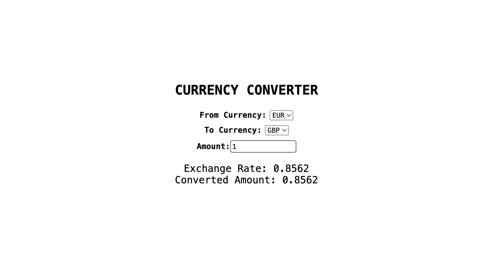

# Currency Converter App

## Overview

Welcome to the Currency Converter App! This web application allows users to convert currencies with real-time exchange rates. You can access the live demo [here](https://currency-converter-flash0p.netlify.app/).

## Features

- Convert between various currencies.
- View real-time exchange rates.
- Responsive design for a seamless experience on different devices.

## Demo

Check out the live demo [here](https://currency-converter-flash0p.netlify.app/).

## Screenshots



## Getting Started

To run the app locally, follow these steps:

1. Clone the repository:

   ```bash
   git clone https://github.com/FaisalKhan2000/Full-stack-development.git
   cd Full-stack-development/react/react-projects/currency-converter
   ```

2. Install dependencies:

   ```bash
   npm install
   ```

3. Start the development server:

   ```bash
   npm start
   ```

4. Open your browser and visit [http://localhost:3000](http://localhost:3000) to view the app.

## Technologies Used

- React
- Axios for API requests

## API Used

- ExchangeRate-API: [https://www.exchangerate-api.com/](https://www.exchangerate-api.com/)

## Contributing

Contributions are welcome! Feel free to open issues or submit pull requests.

## Author

- Faisal Khan
